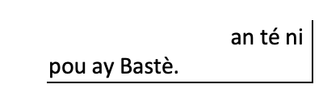
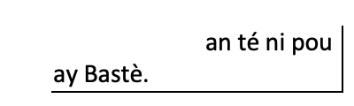
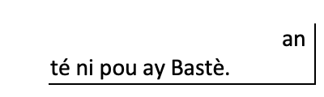

# 2. Tipografi 

## 2.1	Apòstwòf (') é Tilarèl (-)

Nou ka sèvi épi apòstwòf yenki le i ni on lèt tonbé.

```
Annou dansé -> Ann' dansé
An ka enni chouté-w ! -> An k'enn' chouté-w.
```

## 2.2	Granlarèl

Granlarèl "—" ka sèvi pou lè on moun kay palé, oben pou séparé dé pawòl adan on menm fraz.

## 2.3 Pa séparé gwoup modal

Lawvwè gwoup modal-la ni plizyè mo, asiré-w yo ansanm.

Kontèl, sa pa bon



Vométan ou maké 





Oben




Kidonk antrè chak mo a gwoup modal, fo ou mèt on èspas enséparab ( [alt] + [baw èspas]).